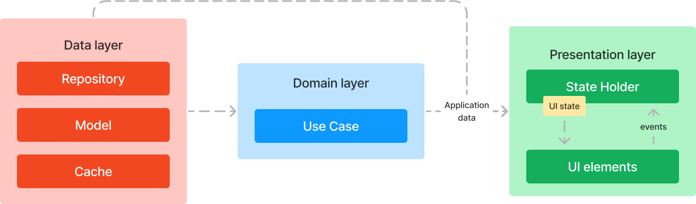

# View :iphone:
View is a Mobile Application allowing users to write and read articles or blogs based on their interests

## Navigation Graph

  

## Screens and Features
### Authentication

* Email and Password Signin / Signup
* _Google_ Signin / Signup
* Reset Password
* Form Validation
* Contributors / Users and Topics _Selection_ phase after first application access
    

  

  

### Home

* _For You_ section: posts are shown based on the current selected filter
* _Trending Now_ section, i.e., most saved posts
* _Following_ section: following users posts
* Posts are loaded as a _Stream_ for instant updates
* More Posts are loaded on end list reaching for better performances

  

### Search and Bookmarks

* Posts can be searched by simply typing the name, topic or author of the Post
* Bookmarked Posts are placed in a single spot

  

### Settings and User Profile

* User Profile Customizaion
* User statistics

  

### Post

* Post creation with required fields for button enabling
* Image Upload

  

### More
* Dark Mode
* Localization for :us:/:uk: and :it: languages
* Responsive Design for tablets

## Architecture

* The **S.O.L.I.D** principles are adhred to make the applications scalable, testable, maintanable, and resilient to change
* The **Dependency Injection** design pattern is implemented

  

## Testing

The application **is _not_** fully tested. Main tests like Unit, Integration, and End-To-End are used to analyze testing within the framework

## Tools
The application is written using the [Jetpack Compose](https://developer.android.com/develop/ui/compose) toolkit. The main libraries used are the following:

### Firebase Integration:
* com.google.firebase:firebase-auth-ktx: Firebase Authentication library for Kotlin
* com.google.firebase:firebase-firestore: Firebase Firestore library.
* com.google.firebase:firebase-storage: Firebase Cloud Storage library.

### Dependency Injection:
* com.google.dagger:hilt-android: Hilt for dependency injection in Android
* androidx.hilt:hilt-navigation-compose: Hilt integration with Compose navigation
  
### Kotlin Coroutines:
* org.jetbrains.kotlinx:kotlinx-coroutines-core: Core coroutines functionality
* org.jetbrains.kotlinx:kotlinx-coroutines-android: Coroutines support for Android
* org.jetbrains.kotlinx:kotlinx-coroutines-play-services: Coroutines extension for Google Play services

### Image Loading:
* io.coil-kt:coil-compose: image loading library for Compose

### Testing:
* androidTestio.mockk:mockk: Mockk framework for Android instrumented tests.
* androidTestandroidx.test.ext:junit: JUnit testing framework for Android.
* androidTestandroidx.compose.ui:ui-test-junit4: Compose UI testing framework
* testcom.google.dagger:hilt-android-testing: Hilt testing libraries.

## Firebase Config
* code/app : your google-services.json
* code/app/src/main/res/values/strings.xml : your web_client_id
* code/app/src/main/res/values-it/strings.xml : your web_client_id